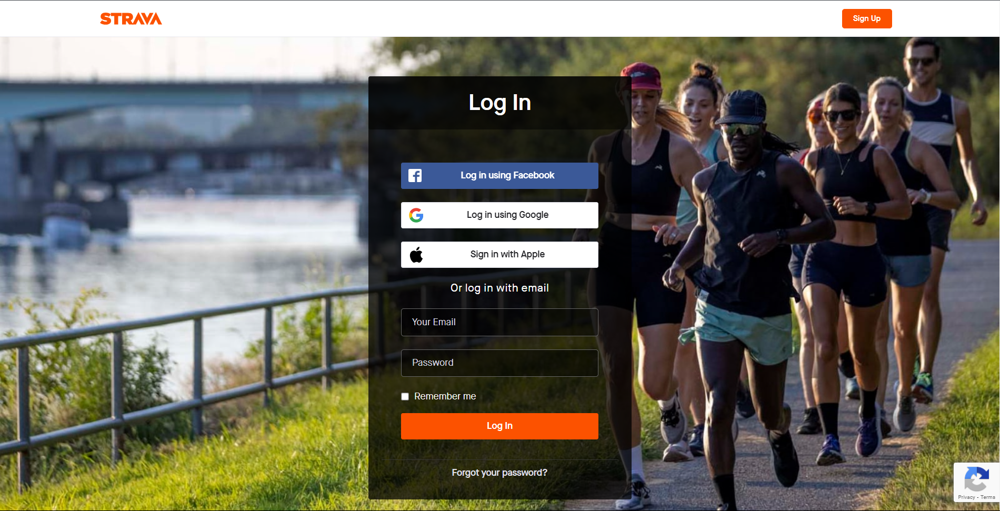
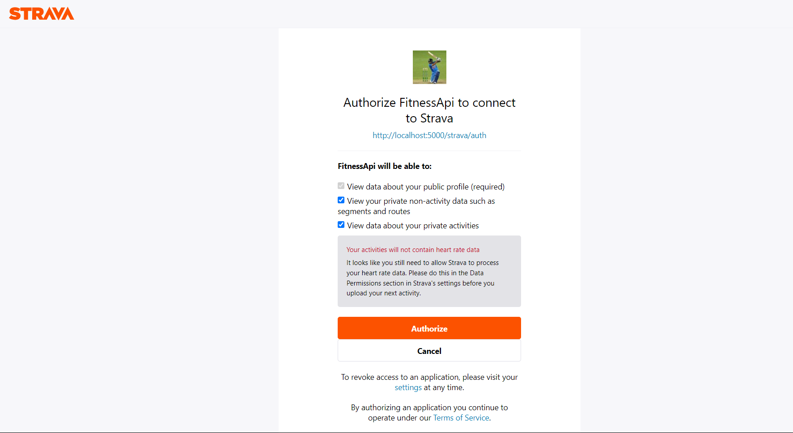
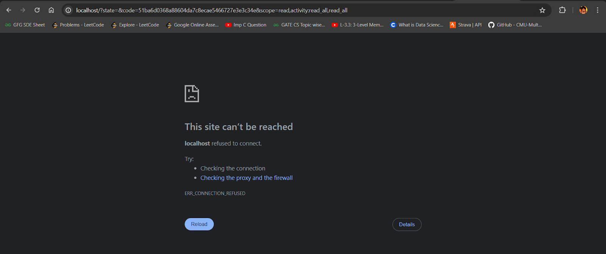
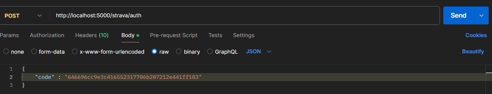
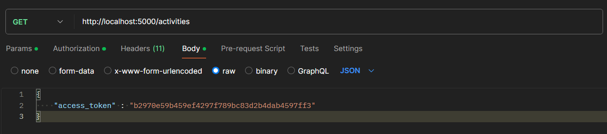
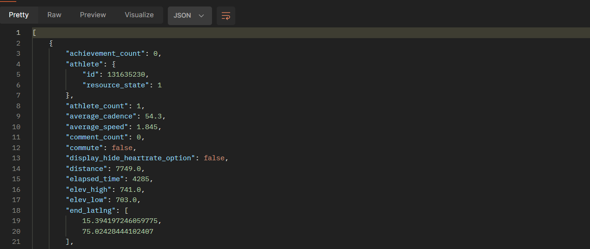

#Procedure

##Installation(Windows OS) 

Install the required dependencies if not installed. Continue with the installation of the API package if these dependencies are satisfied by the System.
 **Flask**:-  This dependency is utilized for building web applications in Python, enabling the creation of routes and functionalities to handle HTTP requests and responses effectively.

* `pip  install flask`

**Requests**:-  It's similar to Postman, Requests is employed to make HTTP requests, including GET and POST, to interact with the Strava API, facilitating communication between the application and the external service.

*  `pip install request`

**dotenv**:-  By leveraging dotenv, the project can securely access environment variables, such as API keys or sensitive configuration settings, stored in **.env file**, ensuring separation of configuration from code.
**os**:-  The os module is utilized to interact with the operating system, specifically for loading environment variables from the .env file into the Python script, providing access to the environment configuration required for the application's execution.


*  `pip install dotenv`
* `pip install jsonify`


Importing the respective packages and ensuring the dependencies are installed according to the following. In your code editor make sure the code is well written:- 


```python
from flask import Flask, request, jsonify
import requests
from dotenv import flaskload_dotenv
import os
```

Now, to install our API use:

* `pip install strava_api`


Moving forward with the usage of API:  
For the Strava OAuth Settings:  

* First, the user should go the official [Strava website](https://www.strava.com/)
There, user has to register himself on Strava, create an account and Login.

* After the login, the user should go to the **Settings** page, there the user will be able to see a option called **"My Apps"**.
Sometimes, if the option is not visible, user has to explicitly go the [https://www.strava.com/settings/api](https://www.strava.com/settings/api) (or apps)

There, if he's new, nothing will be listed prior. Then he has to fill the form accordingly and create his API.
After the successful creation of the API, the user will be able to see the **Client ID and client secret** listed down.

* Copy them and paste them into a **.env file** into their workspace.  


Now as we have completed the Installation process, further  we developed 5 functionalities:   

* Authorization.
* Getting the access token.
* Fetching the activities from the Strava API
* Storing those activities in the database
* Revoking or de-authorization of the API by the user.
* Refreshing the Access token.


##Authorization

To use our API, the user has to authorize himself through his Strava account.   
The **“Authorization”**  function in our API is mainly responsible for generating an authorization URL, which the user uses to get the authorization code. The Authorization code is given by Strava itself.
This process of getting the authorization code can be manually processed or can be automated with the help of front-end.
Before going to steps involved in authorization, let’s briefly see what is this authorization code and what is its significance-

Authorization code, is a crucial part of the **OAuth 2.0** authorization framework. It is a alpha-numeric, temporary, sequence, acting as an intermediary step in the OAuth flow, bridging gap between the user authorization and granting access to our API.
So, here our API authorization route **(“/authorize”)**, defines a function that returns a authorization URL, which is useful in getting authorization code.

**Step-1**:   
First, when the route is accessed, the API server returns a authorization URL, which is of the format:   `f"{STRAVA_AUTH_URL}? client_id={CLIENT_ID}&redirect_uri={REDIRECT_URI}&response_type=code&scope={scope}" `   
This URL is unique to the user using it, as it involves the CLIENT_ID and the REDIRECT_URL of the respective user.
So, let’s briefly talk about “SCOPE”, which is mentioned above in the URL.
Strava's API utilizes various scopes to define the level of access your application can request from a user's Strava account. These scopes are critical for granular control over the data your application can access and ensures user privacy. Here's a breakdown of the different scope types involved in Strava API settings:  

Common Strava Scopes:  

- `read`: Grants read-only access to public profile data, like username and follower count.
- `read_all`: Extends read access to private profile data of the authorized user, including activities, clubs, and gear.
- `profile:read_all`: Specifically grants read access to all profile information of the authorized user.
- profile:write: Allows your application to modify the authorized user's profile data on Strava (use with caution!).
- `activity:read`: Enables read-only access to the authorized user's activity data, including details like distance and elapsed time.
- `activity:read_all`: Provides read access to all activity data, including private activities of the authorized user.
- `activity:write`: Grants your application permission to create, update, or delete activities on the authorized user's Strava account (be mindful of user privacy).  


**Step-2**:   
Here, user have to use the resultant authorization URL to get the authorization code. To perform this, go to browser, and search this URL.
If already not logged into Strava account, the URL prompts user to log in.  




**Step-3**:  
After successful login, the user gets redirected to a authorization page, in which user has to authorize the API to access the user’s details(Depends on the scope defined in the URL.)



**Step-4**:  
After the user authorizes the API, the user will be redirected to an empty website like shown below. Now, the user should copy the respective URL for that page.  



**Step-5**:  
Now, after copying the URL of that page, user can identify a query parameter in the URL, named “code”. Now, copy the value of that parameter from the URL.
That value is the authorization code.   

End of Authorization URL.


##Access Token

Next step in the application, after authorization is, getting access token from the Strava. To get the access token, we make use of the authorization code we have obtained in the previous step. Before going to the steps involved, let’s see what is access token and its significance.  

##### **What is an access token?**

An access token is like a digital key that grants temporary permission to your application to access a user's data on another platform (Strava in this case, or your future platform). It acts as an intermediary between your app and the user's account.  

- *Security*: Access tokens are crucial for maintaining user privacy and security
- *Controlled access*: Access tokens can be granted with specific scopes, limiting the data your application can access on behalf of the user.

#####**How can this be used?**


- Include the access token in an authorization header when making API requests to your platform. This verifies that the request comes from a legitimate application with the user's permission.
The expiration time for access tokens can vary depending on the platform's design. In Strava's case, access tokens expire after *six hours*.
So, this is a brief info on what access token is, and why do we need it. Now, let’s see the steps involved in obtaining access token. 

**Step-1**:  
Now the user has the authorization code, (obtained from the previous step), user can send a POST request to the `(“/strava/auth”)` route of the API to get the access token. This requests in implemented in the API itself with the help of `requests` library, to reduce manual work. SO users can just access the URL or route of the API, and let it do the work for you.  

  



**Step-2**:  
If the entered authorization code turns out to be valid, the API server responds with access token. The access token is sent to the user in `JSON` format. 
If the auth code is invalid, corresponding error message and status code are returned.  

**Step-3**:  
Now, user has the `“access token”`. This allows user to access the authorized data and manipulate it according to the use case. This access token can be used to track, and fetch details about athletes and their activities.


##Fetching Activities from the Strava onto the API

By using the access token we got in the previous step, we can fetch the user’s activities. The access token in the session indicates the user is authorized to the user the API and the API can fetch the data from the Strava easily. 
Before moving to steps involved, let’s see the format, what details the activities in the Strava contain.


Now, let’s see steps involved in getting/fetching the user activities.

**Step-1**:

Send a get request to the API server, to the route `(“/activities”)` with an access token as input, 



**Step-2**:
   
Now, if the access token which is inputted to the URL is valid, then the server responds back to the user with the list of activities under the Strava account.
If there are no activities performed by the account yet, the server returns a empty array or returns a JSON array containing all the fields (as above shown) of a activity or activities performed.



*Note, if the access token is either expired or invalid, the server does not fetch the activities from the Strava. So, then user has to sort the corresponding issue and get back to sending requests to the route of the URL.*


##Storing those activities in the database  

##Revoking or de-authorization of the API by the user:
So, a user can make use of the route `(“/revoke_token”)` to revoke the token. Revoking the token means the API has no longer access to the user’s strava details.

This can also be performed through the strava official page as well.

Send a POST request to the route of the API server.
Now, the API server revokes the access token and replies to you.


##Refreshing the Access token

###**What is a refresh token?**

A refresh token is like a backstage pass that goes along with your access token (the frontstage key). While the access token grants temporary access to a user's data, the refresh token allows your application to acquire new access tokens without needing the user to re-authenticate each time.

####**How can this be used?**

Once an access token expires, your application can send the refresh token back to the authorization server (like Strava's server or your future platform's server) to get a new access token. This typically happens behind the scenes without the user's involvement.

####**Need for refresh token?**
*(Not mandatory, but beneficial)*

Refresh tokens are not essential for every API, but they significantly improve user experience, especially for applications that require frequent access to user data.

The procedure is almost the same as getting the `“access token”`. The only difference is, that instead of sending the refresh token, we send the old, expired access token as input to the server and ask for the new access token.

This can achieved with the help of the `(“/refresh_token”)` route in the API.


***As far as strava is considered, refersh token never expires***


